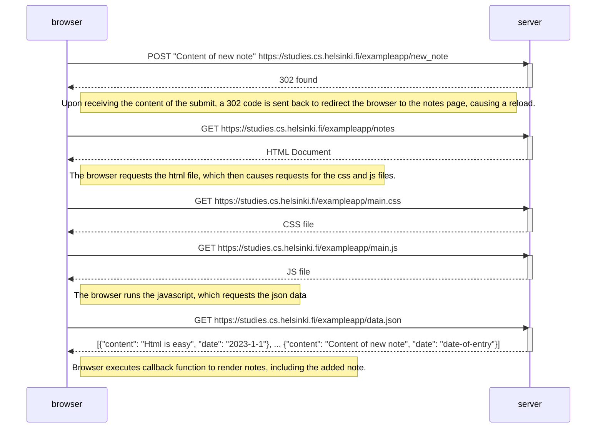

```mermaid
sequenceDiagram
    participant browser
    participant server

    browser->>server: POST "Content of new note" https://studies.cs.helsinki.fi/exampleapp/new_note
    activate server
    server-->>browser: 302 found
    deactivate server

    Note right of browser: Upon receiving the content of the submit, a 302 code is sent back to redirect the browser to the notes page, causing a reload.

    browser->>server: GET https://studies.cs.helsinki.fi/exampleapp/notes
    activate server
    server-->>browser: HTML Document
    deactivate server

    Note right of browser: The browser requests the html file, which then causes requests for the css and js files.

    browser->>server: GET https://studies.cs.helsinki.fi/exampleapp/main.css
    activate server
    server-->>browser: CSS file
    deactivate server

    browser->>server: GET https://studies.cs.helsinki.fi/exampleapp/main.js
    activate server
    server-->>browser: JS file
    deactivate server

    Note right of browser: The browser runs the javascript, which requests the json data
    
    browser->>server: GET https://studies.cs.helsinki.fi/exampleapp/data.json
    activate server
    server-->>browser: [{"content": "Html is easy", "date": "2023-1-1"}, ... {"content": "Content of new note", "date": "date-of-entry"}]
    deactivate server

    Note right of browser: Browser executes callback function to render notes, including the added note.
    
```
