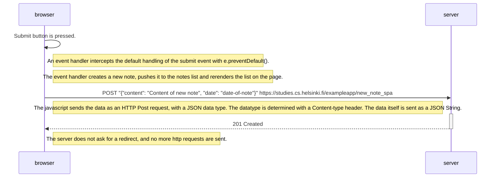

```mermaid
sequenceDiagram
    participant browser
    participant server


    browser->>browser: Submit button is pressed.
    Note right of browser: An event handler intercepts the default handling of the submit event with e.preventDefault().
    Note right of browser: The event handler creates a new note, pushes it to the notes list and rerenders the list on the page.

    browser->>server: POST "{"content": "Content of new note", "date": "date-of-note"}" https://studies.cs.helsinki.fi/exampleapp/new_note_spa

    Note right of browser: The javascript sends the data as an HTTP Post request, with a JSON data type. The datatype is determined with a Content-type header. The data itself is sent as a JSON String.
    activate server
    server-->>browser: 201 Created
    deactivate server
    Note right of browser: The server does not ask for a redirect, and no more http requests are sent.
    
```
